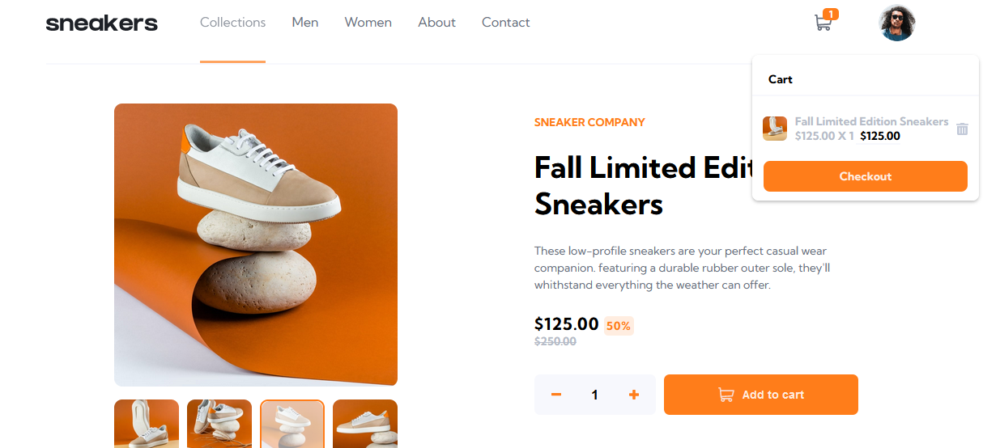
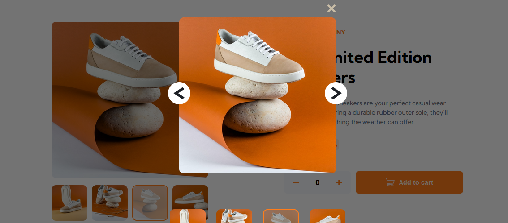
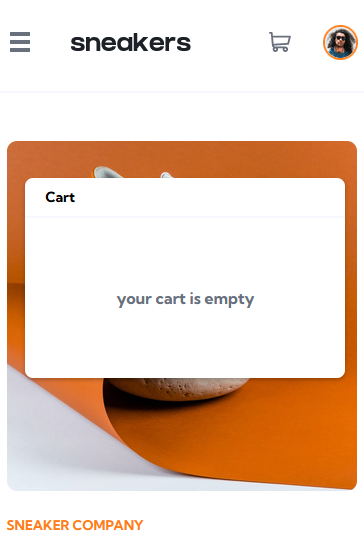
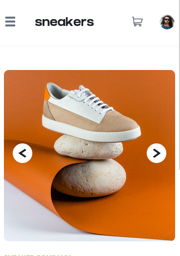
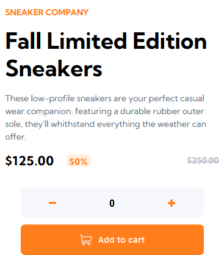
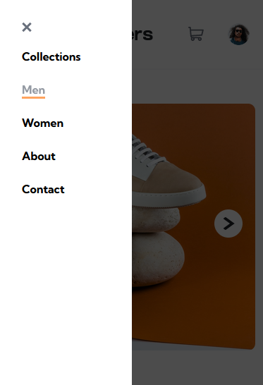

# E-commerce-product-page




> my front end mentor challenge solution using vue.



> popup.



> mobile.



> mobile product.



> mobile description.



> mobile menu.

## 🚀 Install E-commerce-product-page

To install E-commerce-product-page, follow these steps:

```
yarn or npm i
```

## ☕ Using E-commerce-product-page

To use E-commerce-product-page, follow these steps:

```
yarn dev or npm run dev
```

## 📫 Contributing to E-commerce-product-page

To contribute to E-commerce-product-page, follow these steps:

1. Fork this repository.
2. Create a branch: `git checkout -b features`.
3. Make your changes and commit them: `git commit -m '<commit_message>'`
4. Push to original branch: `git push origin E-commerce-product-page / main`
5. Create the pull request.

Alternatively, see the GitHub documentation at [how to create a pull request](https://help.github.com/en/github/collaborating-with-issues-and-pull-requests/creating-a-pull-request).

[⬆ Voltar ao topo](#E-commerce-product-page)<br>
